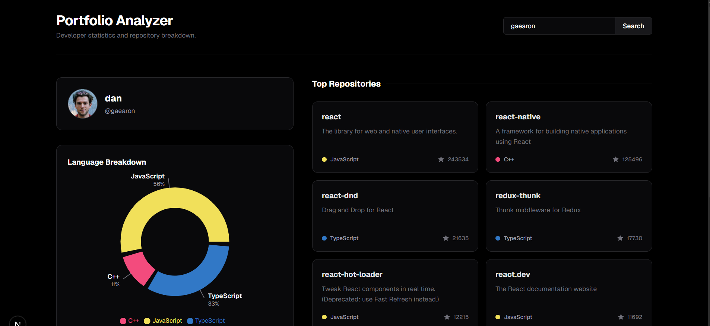

# Portfolio Analyzer

A sleek, dark-mode developer dashboard that visualizes GitHub profiles, top programming languages, and most starred repositories.



## Features

* **Dynamic Search:** Instantly analyze any public GitHub developer profile.
* **Language Breakdown:** Interactive, custom-built donut chart visualizing the user's most-used programming languages.
* **Repository Showcase:** Displays a responsive grid of the user's top-starred open-source projects, including descriptions, primary languages, and star counts.
* **GraphQL Efficiency:** Leverages the GitHub GraphQL API to fetch comprehensive user and repository data in a single, optimized network request.
* **Modern UI:** Built with Tailwind CSS, featuring a custom zinc-and-black minimalist aesthetic.

## Tech Stack

* **Framework:** Next.js (App Router)
* **Styling:** Tailwind CSS
* **Data Visualization:** Recharts
* **Data Fetching:** GitHub GraphQL API

## Getting Started

To run this project locally, you will need Node.js installed and a GitHub Personal Access Token.

1. Clone the repository
```bash
git clone [https://github.com/dylannsp11/portfolio-analyzer.git](https://github.com/dylannsp11/portfolio-analyzer.git)
cd portfolio-analyzer
2. Install dependencies
Bash
npm install
3. Set up your environment variables
Create a .env.local file in the root directory and add your GitHub Personal Access Token (it needs the read:user and repo scopes):

Code snippet
GITHUB_TOKEN=your_personal_access_token_here
4. Run the development server
Bash
npm run dev
Open http://localhost:3000 in your browser to see the application.

License
This project is licensed under the MIT License.

Disclaimer
This project is a personal portfolio piece. It is not affiliated with, endorsed by, or sponsored by GitHub.